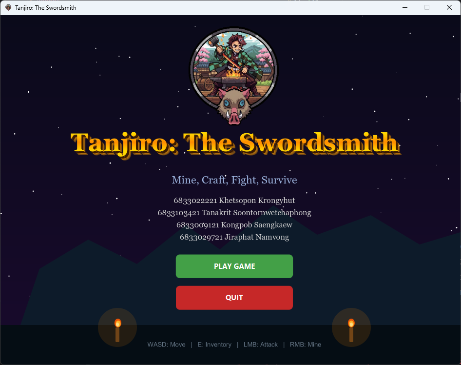

[](https://classroom.github.com/a/IY9augGa)

# Tanjiro: The Swordsmith

A 2D top-down action RPG built with Java and JavaFX, inspired by *Demon Slayer: Kimetsu no Yaiba*. Mine ores, craft
gear, and battle iconic demon bosses.



> For detailed gameplay instructions, see the **[Our Report](docs/Report.md)**.

## Gameplay Loop

```
Mine Ores → Craft Weapons & Armor → Fight Bosses → Win
```

1. **Explore** the world map to mine ore deposits
2. **Craft** swords and armor at the crafting station
3. **Buy** potions and better pickaxes at the shop
4. **Battle** three boss demons in turn-based combat

## Controls

| Input                  | Action                                           |
|------------------------|--------------------------------------------------|
| `W A S D` / Arrow Keys | Move                                             |
| Left Click (hold)      | Attack nearby monsters                           |
| Right Click (hold)     | Mine facing tile                                 |
| `E`                    | Enter nearby building (Shop / Craft / Boss Door) |

## Features

### World Map

- 20×15 tile grid with randomly placed ore deposits and monsters
- Ores and monsters respawn after a short delay
- Three interactive buildings: **Shop**, **Crafting Station**, **Boss Door**

### Mining & Ores

| Ore          | Rarity    |
|--------------|-----------|
| Normal Stone | Common    |
| Hard Stone   | Common    |
| Iron         | Uncommon  |
| Platinum     | Rare      |
| Mithril      | Rare      |
| Vibranium    | Very Rare |

### Crafting

Craft weapons and armor from mined materials at the crafting station. Gear cannot be bought — it must be crafted.

| Tier | Weapon          | Armor           |
|------|-----------------|-----------------|
| 1    | Stone Sword     | Stone Armor     |
| 2    | Hardstone Sword | Hardstone Armor |
| 3    | Iron Sword      | Iron Armor      |
| 4    | Platinum Sword  | Platinum Armor  |
| 5    | Mithril Sword   | Mithril Armor   |
| 6    | Vibranium Sword | Vibranium Armor |

### Shop

Buy support items with gold dropped by monsters and bosses.

| Item           | Effect            | Price |
|----------------|-------------------|-------|
| Small Potion   | Heals 40 HP       | 50g   |
| Medium Potion  | Heals 100 HP      | 100g  |
| Big Potion     | Heals 200 HP      | 200g  |
| Wooden Pick    | Mining Power: 1   | 5g    |
| Normal Pick    | Mining Power: 2   | 10g   |
| Hardstone Pick | Mining Power: 5   | 50g   |
| Iron Pickaxe   | Mining Power: 12  | 100g  |
| Platinum Pick  | Mining Power: 27  | 160g  |
| Mithril Pick   | Mining Power: 45  | 230g  |
| Vibranium Pick | Mining Power: 100 | 310g  |

### Boss Battles

Turn-based combat against three sequential bosses.

| Boss      | Difficulty |
|-----------|------------|
| Akaza     | Easy       |
| Kokushibo | Medium     |
| Muzan     | Hard       |

**Player actions per turn:**

- **Attack** — Normal attack
- **Skills** (with cooldowns):
    - *Kagura Dance* — 2× damage
    - *Dead Calm* — Halves incoming damage this turn
    - *Constant Flux* — 3 rapid hits; reduces your DEF next turn
    - *Water Wheel* — Deals damage and heals 30% back
- **Defend** — Doubles your DEF for the enemy's turn
- **Heal** — Use a potion from inventory
- **Rest** — Recover a small amount of HP

Bosses have a 20% critical hit chance (1.6× damage).

## Requirements

- Java 21+
- Gradle (wrapper included)

## Running the Game

```bash
./gradlew run
```

## Running Tests

```bash
./gradlew test
```

## Javadoc

The generated API documentation is available at [`build/docs/javadoc/index.html`](build/docs/javadoc/index.html).

To regenerate:

```bash
./gradlew javadoc
```

## Project Structure

```
src/
├── main/java/
│   ├── application/       # Entry point (Main, SceneManager)
│   ├── audio/             # AudioManager
│   ├── interfaces/        # Buyable, Craftable, Equipable, Mineable, etc.
│   ├── logic/
│   │   ├── base/          # BaseCreature, BaseItem, BaseWeapon, BaseArmor, BasePotion
│   │   ├── creatures/     # Player, Monster tiers, Boss tiers
│   │   ├── item/          # Weapon, armor, and potion implementations
│   │   ├── pickaxe/       # Pickaxe
│   │   ├── stone/         # Ore implementations
│   │   └── util/          # ItemCounter
│   └── scenes/            # MVC scenes: game, boss, shop, crafting, inventory, gameover
├── main/resources/
│   ├── images/            # Sprites and boss art
│   └── sounds/            # BGM tracks
└── test/java/             # JUnit 5 unit tests
```

## Tech Stack

- **Java 21**
- **JavaFX 21** — UI, rendering, and audio
- **Gradle** — Build system
- **JUnit 5** — Unit testing
