# Report

## Table of Contents

1. [Member](#1-member)
2. [Game Manual](#2-game-manual)
3. [Javadoc](#3-javadoc)
4. [Class Diagram](#4-class-diagram)

---

## 1. Member

1. 6833022221 Khetsopon Krongyhut
2. 6833103421 Tanakrit Soontornwetchaphong
3. 6833009121 Kongpob Saengkaew
4. 6833029721 Jiraphat Namvong

---

## 2. Game Manual

### Table of Contents

1. [Overview](#21-overview)
2. [Getting Started](#22-getting-started)
3. [Controls](#23-controls)
4. [The World Map](#24-the-world-map)
5. [Mining](#25-mining)
6. [World Combat](#26-world-combat)
7. [The Shop](#27-the-shop)
8. [Crafting](#28-crafting)
9. [Boss Battles](#29-boss-battles)
10. [Items & Equipment](#210-items--equipment)
11. [Damage Formula](#211-damage-formula)
12. [Tips & Strategy](#212-tips--strategy)

---

### 2.1 Overview

**Tanjiro: The Swordsmith** is a 2D top-down action RPG inspired by *Demon Slayer: Kimetsu no Yaiba*.

Your goal is to survive in the world, mine rare ores, craft powerful weapons and armor, and defeat three demon bosses in
sequence. The game ends in **victory** when all three bosses are slain, or in **defeat** if the player's HP reaches zero
at any point.

**Core loop:**

```
Mine Ores → Earn Gold from Monsters → Shop / Craft → Enter Boss Room → Repeat
```

---

### 2.2 Getting Started

When you launch the game, you are taken to the **Main Menu**. Press **Start** to begin.

You start with:

- A **Wooden Pickaxe** (power: 2)
- No weapon or armor equipped
- 0 Gold

You are placed at the center of the world map and must begin mining and fighting monsters to progress.

---

### 2.3 Controls

| Input                  | Action                         |
|------------------------|--------------------------------|
| `W` / `↑`              | Move up                        |
| `S` / `↓`              | Move down                      |
| `A` / `←`              | Move left                      |
| `D` / `→`              | Move right                     |
| **Left Click** (hold)  | Attack monsters in melee range |
| **Right Click** (hold) | Mine the tile you are facing   |
| `E`                    | Enter a nearby building        |

> Diagonal movement speed is automatically normalized so you cannot move faster diagonally.

---

### 2.4 The World Map

The map is a **20×15 tile grid**. It contains:

| Element              | Description                                 |
|----------------------|---------------------------------------------|
| Ground / Grass       | Walkable terrain                            |
| Ore Deposits         | Mineable rocks scattered across the map     |
| Monsters             | Roam freely; aggro when you get close       |
| **Shop**             | Top-left area — buy potions and pickaxes    |
| **Crafting Station** | Top-right area — craft weapons and armor    |
| **Boss Door**        | Bottom-center — enter to start boss battles |

#### Respawning

- Destroyed ore deposits **respawn** within 1–2 seconds at a random location.
- Defeated monsters **respawn** within 1–3 seconds at a random location.

> Ores and monsters never run out — the world is always replenished.

---

### 2.5 Mining

Hold **Right Click** while facing an ore tile to mine it. Each click reduces the ore's durability by your pickaxe's
power. When durability reaches zero, the ore breaks and drops materials into your inventory.

#### Ore Stats

| Ore          | Durability | Drops           |
|--------------|------------|-----------------|
| Normal Stone | 5          | 1× Normal Stone |
| Hard Stone   | 15         | 2× Hard Stone   |
| Iron         | 36         | 3× Iron         |
| Platinum     | 80         | 3× Platinum     |
| Mithril      | 120        | 3× Mithril      |
| Vibranium    | 210        | 3× Vibranium    |

#### Pickaxe Power

A higher-power pickaxe reduces durability faster. For example, a Wooden Pickaxe (power 2) takes **18 hits** to break an
Iron deposit (durability 36), while an Iron Pickaxe (power 12) breaks it in **3 hits**.

| Pickaxe              | Power |
|----------------------|-------|
| Wooden Pickaxe       | 2     |
| Normal Stone Pickaxe | 3     |
| Hard Stone Pickaxe   | 5     |
| Iron Pickaxe         | 12    |
| Platinum Pickaxe     | 27    |
| Mithril Pickaxe      | 45    |
| Vibranium Pickaxe    | 100   |

> Vibranium (durability 210) requires at least a **Platinum Pickaxe** (power 27) to mine in a reasonable number of hits.
> A Wooden Pickaxe would take 105 hits.

---

### 2.6 World Combat

Hold **Left Click** to attack monsters within melee range. There is a **600 ms cooldown** between attacks.

Monsters that spot you (within ~5 tiles) will chase and attack you. When not aggroed, they wander randomly. After taking
damage you have a brief **invincibility window** so you cannot be hit repeatedly.

#### Monsters

| Monster        | HP  | ATK | DEF | Gold Drop |
|----------------|-----|-----|-----|-----------|
| Easy Monster   | 40  | 12  | 1   | 20g       |
| Medium Monster | 90  | 22  | 4   | 40g       |
| Hard Monster   | 160 | 32  | 8   | 80g       |

> Killed monsters drop gold directly into your wallet and respawn shortly after.

---

### 2.7 The Shop

Walk near the **Shop building** (top-left) and press `E` to enter. The shop sells potions for healing and pickaxes for
faster mining. Weapons and armor are **not sold here** — they must be crafted.

#### Potions

| Item          | Effect          | Price |
|---------------|-----------------|-------|
| Small Potion  | Restores 40 HP  | 50g   |
| Medium Potion | Restores 100 HP | 100g  |
| Big Potion    | Restores 200 HP | 200g  |

#### Pickaxes

| Pickaxe        | Power | Price |
|----------------|-------|-------|
| Wooden Pick    | 2     | 5g    |
| Normal Pick    | 3     | 10g   |
| Hardstone Pick | 5     | 50g   |
| Iron Pickaxe   | 12    | 100g  |
| Platinum Pick  | 27    | 160g  |
| Mithril Pick   | 45    | 230g  |
| Vibranium Pick | 100   | 310g  |

> Buying a higher-tier pickaxe replaces your current one immediately.

---

### 2.8 Crafting

Walk near the **Crafting Station** (top-right) and press `E` to open it. Crafting requires both **materials** from
mining and **gold** as a crafting fee.

Crafted items go to your inventory. To gain their stat bonuses, you must **equip** them from the inventory screen.

#### Weapons

Equipping a weapon increases your **ATK** stat by the weapon's damage value.

| Weapon          | ATK Bonus | Crafting Cost | Materials Required              |
|-----------------|-----------|---------------|---------------------------------|
| Stone Sword     | +15       | 10g           | 10× Normal Stone                |
| Hardstone Sword | +20       | 50g           | 5× Normal Stone, 10× Hard Stone |
| Iron Sword      | +30       | 100g          | 5× Normal Stone, 8× Iron        |
| Platinum Sword  | +45       | 160g          | 8× Iron, 10× Platinum           |
| Mithril Sword   | +70       | 230g          | 5× Platinum, 15× Mithril        |
| Vibranium Sword | +100      | 310g          | 10× Mithril, 15× Vibranium      |

#### Armor

Equipping armor increases your **DEF** and **Max HP** stats.

| Armor           | DEF Bonus | HP Bonus | Crafting Cost | Materials Required              |
|-----------------|-----------|----------|---------------|---------------------------------|
| Stone Armor     | +5        | +10      | 10g           | 10× Normal Stone                |
| Hardstone Armor | +10       | +15      | 50g           | 5× Normal Stone, 10× Hard Stone |
| Iron Armor      | +15       | +40      | 100g          | 5× Normal Stone, 8× Iron        |
| Platinum Armor  | +25       | +60      | 160g          | 8× Iron, 10× Platinum           |
| Mithril Armor   | +40       | +100     | 230g          | 5× Platinum, 15× Mithril        |
| Vibranium Armor | +55       | +150     | 310g          | 10× Mithril, 15× Vibranium      |

> You can only equip **one weapon** and **one armor** at a time. Equipping a new piece automatically unequips the
> previous one and returns its stat bonuses.

---

### 2.9 Boss Battles

Walk near the **Boss Door** (bottom-center) and press `E` to enter the boss room. Boss fights are **turn-based** — you
and the boss alternate actions.

You must defeat **3 bosses in sequence** without leaving the room. Your HP carries over between fights.

#### Bosses

| Boss      | HP    | ATK | DEF | Gold Reward |
|-----------|-------|-----|-----|-------------|
| Akaza     | 500   | 60  | 15  | 900g        |
| Kokushibo | 900   | 80  | 22  | 2,100g      |
| Muzan     | 1,600 | 100 | 38  | 4,500g      |

[//]: # (> Boss gold rewards are 3× their base drop value.)

#### Your Turn — Available Actions

##### Attack

A normal attack dealing `ATK − Boss DEF` damage (minimum 0).

##### Skills

Each skill has an individual cooldown measured in turns.

| Skill         | Effect                                                                 | Cooldown |
|---------------|------------------------------------------------------------------------|----------|
| Kagura Dance  | Deal **2× ATK** damage to the boss                                     | 3 turns  |
| Dead Calm     | Reduce the next incoming hit by **50%**                                | 2 turns  |
| Constant Flux | Deal **3 rapid hits** (3× ATK total), but your DEF is halved next turn | 4 turns  |
| Water Wheel   | Deal normal damage and **heal 30%** of the damage dealt                | 5 turns  |

##### Defend

Temporarily doubles your DEF for the upcoming enemy turn. Resets after the enemy attacks.

##### Heal

Opens your potion inventory. Select a potion to consume it immediately.

##### Rest

Recover `max(5, MaxHP / 10)` HP without using a potion. Counts as your turn.

#### Enemy Turn

After every player action the boss attacks. Bosses have a **20% chance to land a critical hit** that deals **1.6× damage
**.

Damage you receive: `max(0, Boss ATK − Your DEF)`.

#### Winning & Losing

- Defeat all 3 bosses → **Victory screen**
- Player HP reaches 0 at any point → **Game Over screen**

---

### 2.10 Items & Equipment

#### Potions

| Item                 | Heal Amount |
|----------------------|-------------|
| Small Health Potion  | 40 HP       |
| Medium Health Potion | 100 HP      |
| Big Health Potion    | 200 HP      |

Potions can be used both during **world exploration** (from inventory) and during **boss battles** (via the Heal
action).

#### Equipment Slots

| Slot   | Effect                   |
|--------|--------------------------|
| Weapon | Increases ATK            |
| Armor  | Increases DEF and Max HP |

You can view and change equipment from the **Inventory** screen.

---

### 2.11 Damage Formula

All damage in the game follows this formula:

```
Damage Dealt = max(0, Attacker ATK − Defender DEF)
```

If the attacker's ATK is less than or equal to the defender's DEF, the attack deals **0 damage**. This makes DEF very
important against high-ATK bosses.

**Boss Critical Hit:**

```
Critical Damage = Boss ATK × 1.6   (20% chance)
Final Damage = max(0, Critical Damage − Your DEF)
```

---

### 2.12 Tips & Strategy

**Early game:**

- Start by mining **Normal Stone** with your Wooden Pickaxe and craft a **Stone Sword** and **Stone Armor** as soon as
  possible.
- Kill Easy Monsters to earn early gold for a better pickaxe.

**Mid game:**

- Upgrade to an **Iron Pickaxe** before attempting to mine Platinum efficiently.
- Craft **Iron** or **Platinum** gear before entering the boss room.

**Boss battles:**

- Use **Dead Calm** before a boss attack when you anticipate high damage.
- **Constant Flux** deals the most total damage but leaves you vulnerable — use it when your armor can absorb the
  counter-attack.
- **Water Wheel** is sustainable — use it to stay healed without burning potions.
- Stock up on **Medium or Big Potions** before entering the boss room.
- Use **Defend** instead of a skill when all skills are on cooldown.

**Gear recommendation for each boss:**

| Boss      | Recommended Minimum Gear          |
|-----------|-----------------------------------|
| Akaza     | Iron Sword + Iron Armor           |
| Kokushibo | Platinum Sword + Platinum Armor   |
| Muzan     | Vibranium Sword + Vibranium Armor |

---

## 3. Javadoc

The full API documentation is available at:

**[`../build/docs/javadoc/index.html`](../build/docs/javadoc/index.html)**

To regenerate the Javadoc:

```bash
./gradlew javadoc
```

---

## 4. Class Diagram

The class diagram is split into multiple diagrams by package for clarity.

### 4.1 Interfaces

Core interfaces implemented throughout the codebase.

| Interface    | Key Methods                                                                   |
|--------------|-------------------------------------------------------------------------------|
| `Equipable`  | `equip(Player)`, `unequip(Player)`                                            |
| `Mineable`   | `mine(int,Player)`, `isBroken()`, `getDurability()`, `getMaxDurability()`    |
| `Consumable` | `consume(Player)`                                                             |
| `Craftable`  | `getCraftingPrice()`, `getRecipe()`, `canCraft(Player)`, `craft(Player)`     |
| `Buyable`    | `getPrice()`                                                                  |
| `Lootable`   | `dropMoney()`                                                                 |
| `Stackable`  | `maxStack`                                                                    |

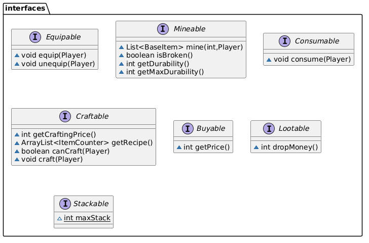

---

### 4.2 Logic — Base Classes

Abstract base classes for all game entities and items.

- **`BaseItem`** — common name, stackable flag, and max-stack for all items.
- **`BaseCreature`** — shared HP/ATK/DEF stats and `attack()` for both the player and monsters.
- **`BaseWeapon`** — extends `BaseItem`; implements `Equipable` & `Craftable`. Stores damage, crafting price, and cooldown.
- **`BaseArmor`** — extends `BaseItem`; implements `Equipable` & `Craftable`. Stores DEF, ATK, SPD, HP, and crafting price.
- **`BasePotion`** — extends `BaseItem`; implements `Consumable`. Stores the heal/stat value.

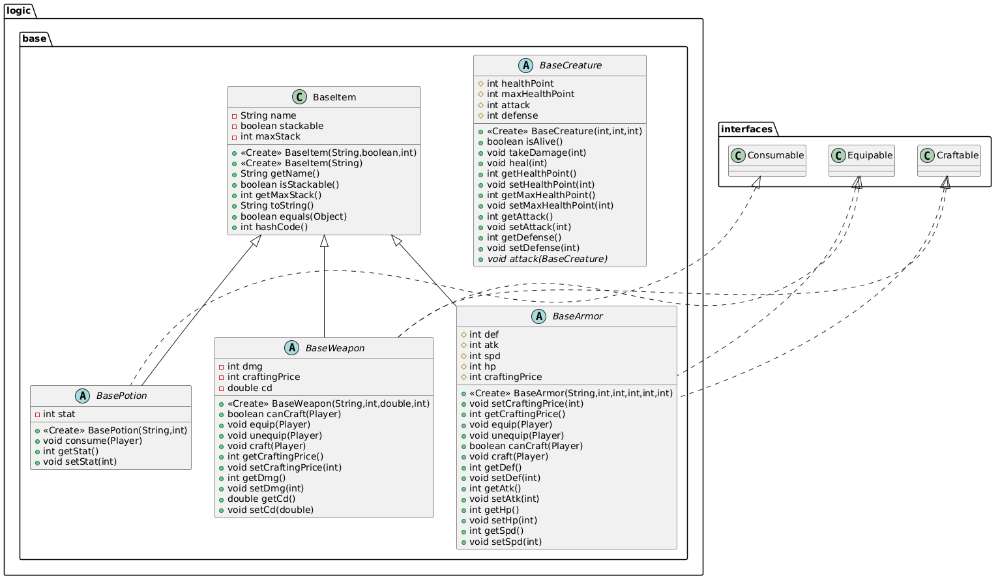

---

### 4.3 Logic — Creatures

Player and monster class hierarchy.

- **`Player`** — extends `BaseCreature`. Holds gold, inventory (`ArrayList<ItemCounter>`), speed, equipped weapon/armor, and all skill methods (`skillKaguraDance`, `skillDeadCalm`, `skillConstantFlux`, `skillWaterWheel`).
- **`Player$SkillResult`** — inner record holding the outcome of a skill (damage, heal, shieldWall, berserkDebuff).
- **`Monster`** — abstract, extends `BaseCreature`; implements `Lootable`. Concrete subclasses: `EasyMonster`, `MediumMonster`, `HardMonster`.
- **Boss monsters** (`EasyBoss`, `MediumBoss`, `HardBoss`) — also extend `Monster`.

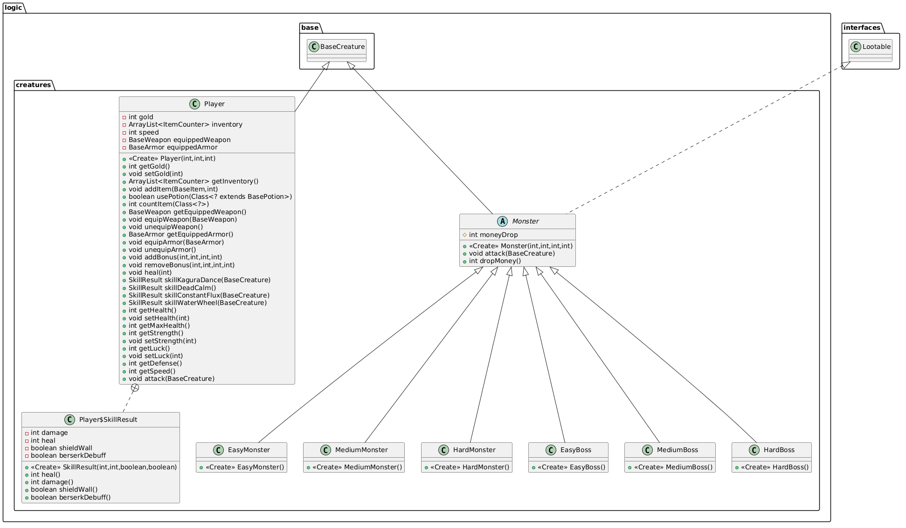

---

### 4.4 Logic — Items

#### ItemCounter (util)

A utility wrapper pairing a `BaseItem` with a stack `count`.

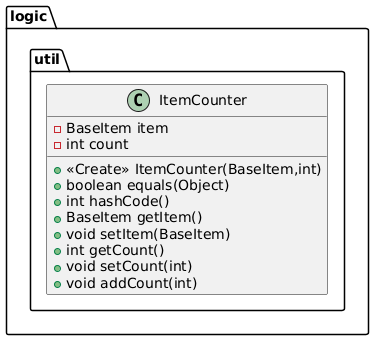

#### Weapons

Seven concrete weapon classes (`WoodenSword` … `VibraniumSword`) all extend `BaseWeapon` and override `getRecipe()`.

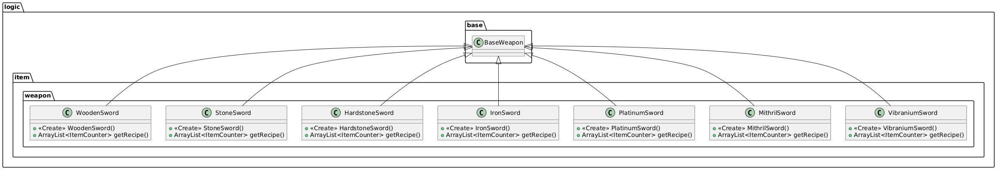

#### Armor

Six concrete armor classes (`StoneArmor` … `VibraniumArmor`) all extend `BaseArmor` and override `getRecipe()`.

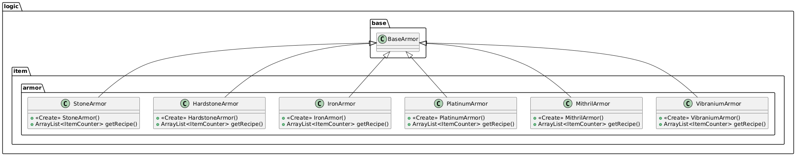

#### Potions

Four concrete potion classes (`SmallHealthPotion`, `MediumHealthPotion`, `BigHealthPotion`, `HealPotion`) extend `BasePotion`. `HealPotion` overrides `consume(Player)`.

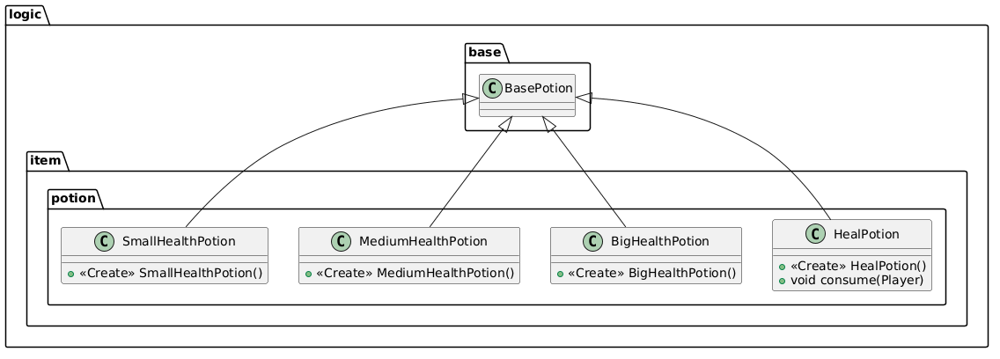

---

### 4.5 Logic — Stone & Pickaxe

- **`Pickaxe`** — extends `BaseItem`. Provides static factory methods for each tier and a `use(Mineable, Player)` method.
- **`baseStone`** — abstract, extends `BaseItem`; implements `Mineable`. Stores `durability`, `maxDurability`, and `dropAmount`. Concrete subclasses: `NormalStone`, `HardStone`, `Iron`, `Platinum`, `Mithril`, `Vibranium`.

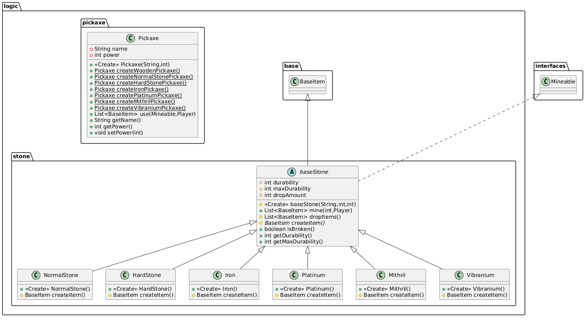

---

### 4.6 Scenes — Game

The main world scene.

- **`GameController`** — central game loop class. Manages the tile world, player position, monsters, ore respawning, movement, attack, and mining. Contains inner classes `MonsterEntity` and `FloatingText`.
- **`GameView`** — JavaFX canvas renderer. Holds references to all sub-controllers (shop, crafting, inventory) and draws the world, player, monsters, HUD, and floating texts.
- **`BuildingType`** — enum (`NONE`, `SHOP`, `CRAFT`, `BOSS`).

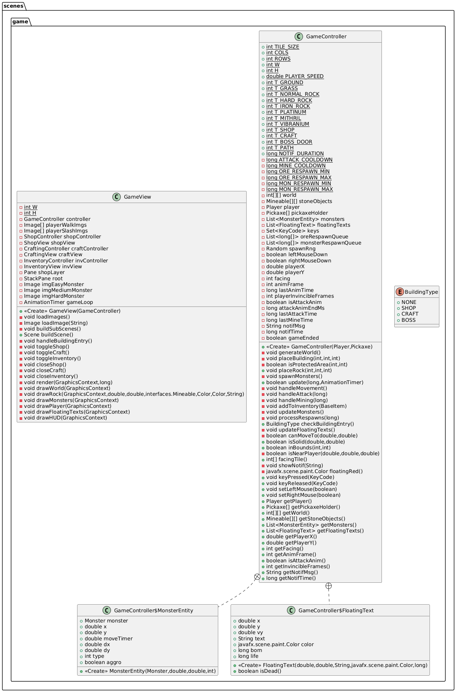

---

### 4.7 Scenes — Boss

The turn-based boss battle scene.

- **`BossController`** — orchestrates the battle loop. Tracks boss sequence, battle state, pending animations, and player actions. Contains inner class `BossInfo`.
- **`BossView`** — renders the boss arena, HP bars, player/boss sprites, and turn indicator.
- **`BattleMenuController`** — manages skill cooldowns, shield-wall and berserk-debuff flags, and potion list. Contains inner record `PotionEntry`.
- **`SkillMenuView`** — skill selection panel with button states.
- **`HealMenuView`** — potion selection panel.
- **Enums:** `BattleState` (`PLAYER_TURN`, `ENEMY_TURN`, `VICTORY`, `DEFEAT`, `ALL_CLEAR`), `ActionResult` (`NONE` … `PLAYER_DEFEATED`), `MenuState` (`NONE`, `SKILLS`, `HEAL`).

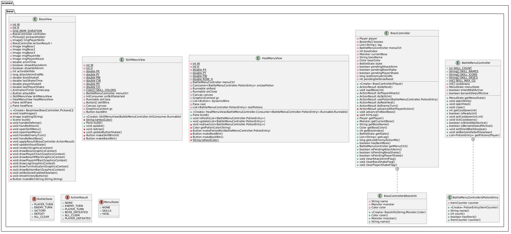

---

### 4.8 Scenes — Shop

- **`ShopController`** — holds the item catalogue and processes purchases via `buy(ShopItem)`. Returns a `BuyResult` inner record.
- **`ShopView`** — renders the shop card grid and feedback messages.
- **`ShopController$ShopItem`** — inner record (name, description, price, `onBuy` consumer).
- **`ShopController$BuyResult`** — inner record (success flag, message).

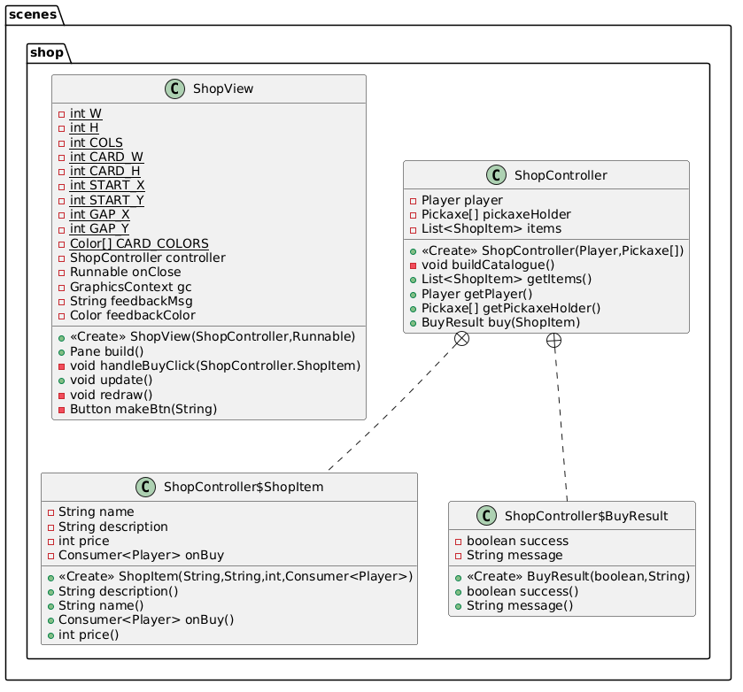

---

### 4.9 Scenes — Other

- **`CraftingController` / `CraftingView`** — recipe list, crafting logic, and UI. `CraftingController$CraftResult` inner record for success/message.
- **`InventoryController` / `InventoryView`** — paginated inventory display, equip/unequip/use-potion actions.
- **`MainMenuController` / `MainMenuView`** — start-screen with animated stars.
- **`GameOverController` / `GameOverView`** — victory/defeat screen with particle effects.

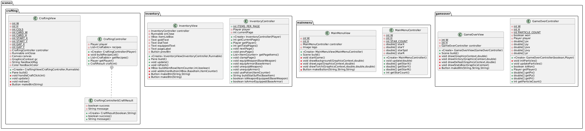

---

### 4.10 Application & Audio

- **`Main`** — JavaFX `Application` entry point; creates `SceneManager` and calls `showMainMenu()`.
- **`SceneManager`** — manages scene transitions: `showMainMenu()`, `showGame()`, `showBossRoom()`, `showGameOver()`.
- **`AudioManager`** — wraps JavaFX `MediaPlayer` for background music (`playBGM`, `stopBGM`, `setVolume`).

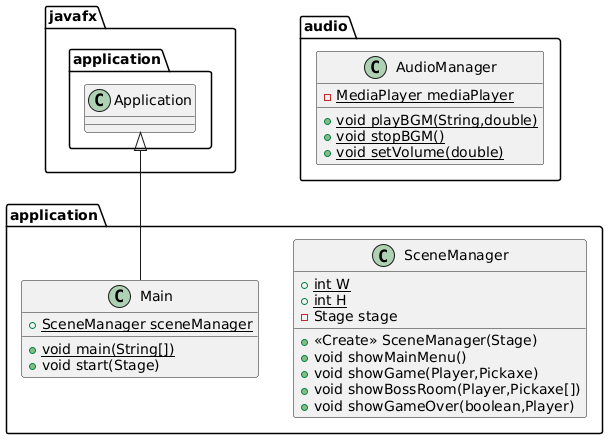

---

### 4.11 Test Classes

JUnit test classes organised by the package they target.

#### Armor Tests (`ArmorTest`)

`ArmorTest` is the outer test class (holds a shared `Player` fixture and `@BeforeEach setup()`). Each armor tier has its own inner test class:

| Inner Class                      | Armor Under Test  |
|----------------------------------|-------------------|
| `ArmorTest$StoneArmorTests`      | `StoneArmor`      |
| `ArmorTest$HardstoneArmorTests`  | `HardstoneArmor`  |
| `ArmorTest$IronArmorTests`       | `IronArmor`       |
| `ArmorTest$PlatinumArmorTests`   | `PlatinumArmor`   |
| `ArmorTest$MithrilArmorTests`    | `MithrilArmor`    |
| `ArmorTest$VibraniumArmorTests`  | `VibraniumArmor`  |

Each inner class verifies: name, stats (def/hp/atk/spd), crafting price, recipe size & contents, `equip` increases DEF and Max HP, `canCraft` and `craft` behaviour (gold deduction, material consumption).

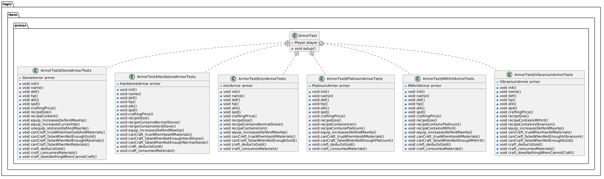

#### Creatures Tests (`CreaturesTest`)

`CreaturesTest` groups monster and boss tests as inner classes. Each tests initial stats, `isAlive`, `takeDamage`, `heal`, `attack`, and `dropMoney`.

| Inner Class                         | Creature Under Test |
|-------------------------------------|---------------------|
| `CreaturesTest$EasyMonsterTests`    | `EasyMonster`       |
| `CreaturesTest$MediumMonsterTests`  | `MediumMonster`     |
| `CreaturesTest$HardMonsterTests`    | `HardMonster`       |
| `CreaturesTest$EasyBossTests`       | `EasyBoss`          |
| `CreaturesTest$MediumBossTests`     | `MediumBoss`        |
| `CreaturesTest$HardBossTests`       | `HardBoss`          |

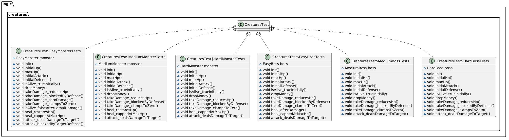

#### Player Tests (`TestPlayerClass` / `CreaturesTest$PlayerTests`)

Two complementary test classes cover `Player` logic:

- **`TestPlayerClass`** — standalone class testing stats, bonus add/remove, gold clamping, inventory management, potion use, and all four skills (`kaguraDance`, `deadCalm`, `constantFlux`, `waterWheel`).
- **`CreaturesTest$PlayerTests`** — inner class of `CreaturesTest` covering the same areas with additional edge-case tests (negative gold clamped to zero, stackable item merging, `equipWeapon`/`equipArmor` replace-existing, `addBonus`/`removeBonus`, `setStrength`/`setLuck`).

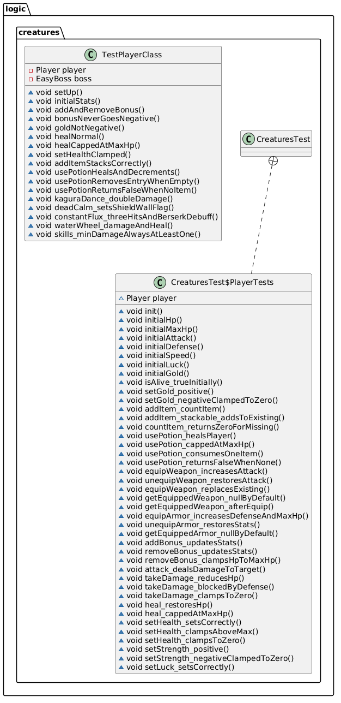

#### Stone Tests (`StoneTest`)

`StoneTest` (with a `Player` fixture) tests every ore type: initial durability, `isBroken` false initially, `mine` reduces durability, breaks at exact durability, drops returned on break, returns empty list before break, and zero/negative pick-power treated as 1. Also verifies mined drops are added to the player's inventory.

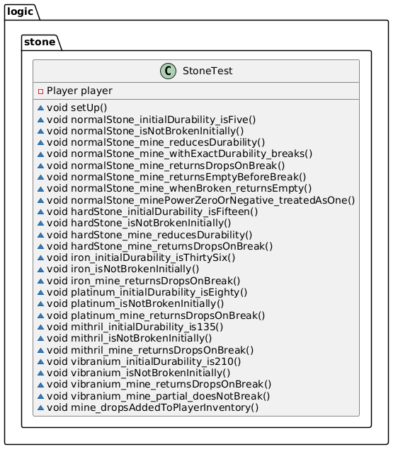

#### Pickaxe Tests (`PickaxeTest`)

`PickaxeTest` verifies the `Pickaxe` class: constructor sets name and power, power clamped to 1 for zero/negative values, all seven factory methods (`createWoodenPickaxe` … `createVibraniumPickaxe`) produce correct name and power, `setPower`, and `use` behaviour (unbroken stone returns empty list, repeated use until broken returns drops, use on already-broken stone returns empty list, weak pickaxe requires multiple hits to break a hard stone).

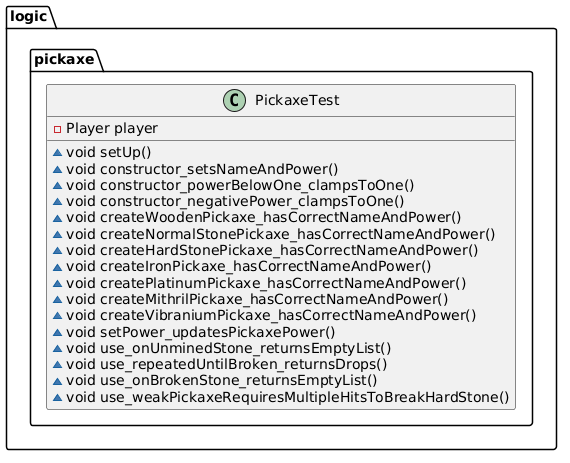

#### Potion Tests (`PotionTest`)

`PotionTest` covers all three potion tiers: correct heal amounts (40 / 100 / 200 HP), healing capped at max HP, `stat` field values, `consume` decrements inventory count, and `maxStack` value.

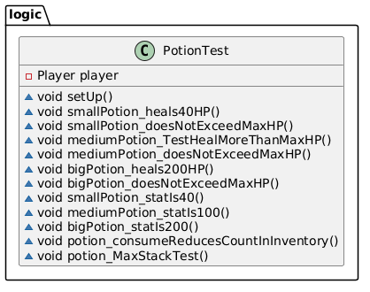

#### Weapon Tests (`WeaponTest`)

`WeaponTest` tests all seven weapon tiers: `equip` increases ATK, `unequip` restores ATK, stat values, `canCraft`/`craft` with enough materials, crafting deducts gold and materials, equipping a new weapon replaces the old one, `isStackable` is false, and `canCraft` fails without gold.

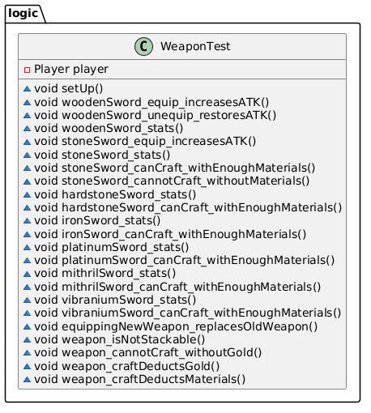
